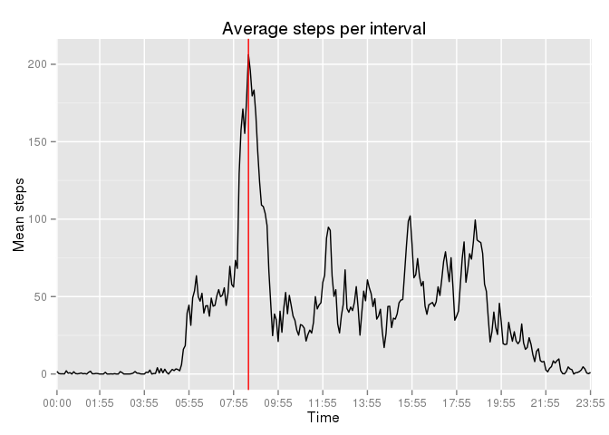
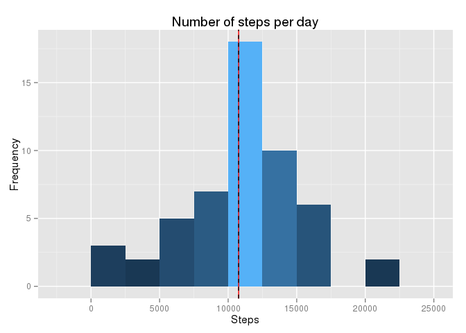
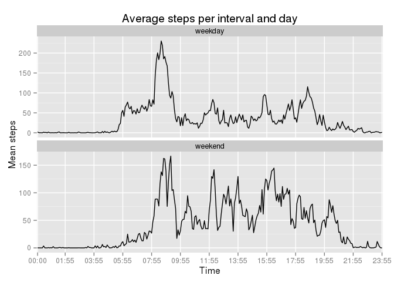

<!--- This is a comment block (it will not show on compiled document).
I will use comments like this to clarify occasional Markdown constructs.

I.e., the previous code block makes sure "echo" is on along all
the document by setting the global option. It also enablese caching.
Loading the knitr package is needed to be able to call opts_chunk function.

WARNING: The code in this document requires several extra packages to work. The list of packages that have to be installed are:
* knitr (of course!)
* data.table
* ggplot2
* plyr

-->


# Reproducible Research: Peer Assessment 1

This project is an assignment for the [Reproducible research](https://www.coursera.org/course/repdata) Coursera course.

It documents the processing of the data contained in "activity.zip", which was provided in the original fork from repository [https://github.com/rdpeng/RepData_PeerAssessment1](https://github.com/rdpeng/RepData_PeerAssessment1) at the 14th July 2014, and gives the answers to the questions formulated in the assignment page.

**WARNING: The code in this document requires several extra packages to work. The list of packages that have to be installed are:  
* knitr (of course!)  
* data.table  
* ggplot2  
* plyr  
**
\
\
\  
<!---
These backslashes, linebreaks and spaces can be used to add some extra vertical space. I will use them before headers to clarify the document's layout.
-->

## Loading and preprocessing the data

The data first has to be read into R.

For this, we wil first store the compressed file name, and the name of the file inside it into two variables. So, if we would ever want to reproduce this analysis on other data, we would only need to change these filenames:


```r
localZip <- "activity.zip"
localCsv <- "activity.csv"
```

Now we are going to open a direct connection to the compressed csv file inside the zip, and read the data into a data table. Prior to this, we load the data table package:


```r
library(data.table)

# Open connection to zip content
con <- unz(localZip, localCsv)

# Read table with format
data <- data.table(read.csv(con, colClasses=c("integer","factor","integer")))
```

To make sure we have loaded some data, we are going to peek into the summary of what we have read and also take a look at the first and last 5 lines of the data:


```r
summary(data)
```

```
##      steps               date          interval   
##  Min.   :  0.0   2012-10-01:  288   Min.   :   0  
##  1st Qu.:  0.0   2012-10-02:  288   1st Qu.: 589  
##  Median :  0.0   2012-10-03:  288   Median :1178  
##  Mean   : 37.4   2012-10-04:  288   Mean   :1178  
##  3rd Qu.: 12.0   2012-10-05:  288   3rd Qu.:1766  
##  Max.   :806.0   2012-10-06:  288   Max.   :2355  
##  NA's   :2304    (Other)   :15840
```

```r
head(data,5)
```

```
##    steps       date interval
## 1:    NA 2012-10-01        0
## 2:    NA 2012-10-01        5
## 3:    NA 2012-10-01       10
## 4:    NA 2012-10-01       15
## 5:    NA 2012-10-01       20
```

```r
tail(data,5)
```

```
##    steps       date interval
## 1:    NA 2012-11-30     2335
## 2:    NA 2012-11-30     2340
## 3:    NA 2012-11-30     2345
## 4:    NA 2012-11-30     2350
## 5:    NA 2012-11-30     2355
```

It is interesting to note that the "interval" values are times coded into an integer value. We could directly encode them as a factor, but it will be more convenient to first convert them back to a more legible time format. Converting into a factor is also necessary since the "interval" data is not continous: as there are only 60 minutes in each hour, there will be no intervals ending with numbers between 55 and 99. If we would leave the data as integers, the plotting functions would assume the data is continous, and this might lead to strange artifacts in the plotting.


```r
# Transform integer to zero-padded string
data$interval <- sprintf("%04d",data$interval)

# Insert colon between hours and minutes
data$interval <- sprintf("%s:%s",substring(data$interval,1,2),
                         substring(data$interval,3,4))

# Convert into factor
data$interval <- factor(data$interval)
```
\
\
\  

## What is mean total number of steps taken per day?

To calculate the mean and median of steps per day, we first have to remove all NAs from the table, then compute the total number of steps for each day, and finally compute mean, median and plot the data:


```r
# This will be useful later on
dataNAs <- is.na(data$steps)

# Summarize data
dailytotal <- data[!dataNAs,list(total=sum(steps)),by=date]

# Get mean and median
meansteps <- mean(dailytotal$total)
mediansteps <- median(dailytotal$total)
```

<!--- In the next paragraph I use the options "scipen" and "digits" to format the value of the mean to be shown in the processed html page as just an integer number (default would be scientific notation), just as the median -->
At this point we know that the mean number of steps per day is 10766, and that the median is 10765. Now we will do the plotting using the ggplot2 package (make sure you have it installed):


```r
library(ggplot2)
p <- ggplot(dailytotal) +
    geom_histogram(binwidth=2500, aes(x=total, fill=..count..)) +
    xlab("Steps") + ylab("Frequency") + ggtitle("Number of steps per day") +
    geom_vline(aes(xintercept=meansteps),color="red") +
    geom_vline(aes(xintercept=mediansteps),color="black", linetype="dashed") +
    theme(legend.position="none")
print(p)
```

 

In the histogram, mean value is drawn with a continous red line, and median is drawn with a dashed black line.
\
\
\  

## What is the average daily activity pattern?

We need to average each time interval over all dates we have data from (we also have to exclude NAs). We also convert back the intervals

At the same time, we extract the rows (in case there is more than one with the same value) which have the maximum number of steps:


```r
# Calculate means by interval
intervalmeans <- data[!is.na(steps),list(mean=mean(steps)),by=interval]

# Get maximum activity interval(s)
maxactivity <- intervalmeans[mean == max(intervalmeans$mean), ]
```

The interval(s) with the highest average activity value(s) are the following ones:

```r
maxactivity
```

```
##    interval mean
## 1:    08:35  206
```
(For the original data for which this code was created, there is only one ocurrence of the maximum activity, around 206 steps, at the 8:35 interval.)

The activity plot looks like the following, with the first maximum activity interval marked with a red line:

```r
p <- ggplot(intervalmeans, aes(x=interval, y=mean, group=1)) + geom_line() +
    xlab("Time") + ylab("Mean steps") + ggtitle("Average steps per interval") +
    geom_vline(aes(xintercept=as.numeric(maxactivity$interval[1])),color="red") +
    scale_x_discrete(breaks = levels(intervalmeans$interval)
                     [seq(1, 288, length.out=13)]) +
    theme(legend.position="none")
print(p)
```

 
\
\
\  
    
## Imputing missing values

First we will count how many missing data we have:


```r
missingcount = sum(is.na(data$steps))
missingcount
```

```
## [1] 2304
```

So, we have 2304 missing values. We will assume that the missing values are equal to the mean value for that interval for all the data set (we cannot give them the average value for the corresponding day, since the values are missing for full days). We create new data set with this assumption:


```r
# We will the plyr library
library(plyr)
filleddata <- copy(data)

# Add means column
filleddata <- join(filleddata, intervalmeans, by="interval")

# Copy mean values to steps column where steps is NA
filleddata$steps[dataNAs] <- filleddata$mean[dataNAs]
```

Now, we repeat the treatment that we did in the first part of the assignment:


```r
# Summarize data -- just like we did in the first part of the assignment
dailytotal <- filleddata[!dataNAs,list(total=sum(steps)),by=date]

# Get mean and median
meansteps <- mean(dailytotal$total)
mediansteps <- median(dailytotal$total)
```

Again, we have a mean of 10766 and a median of 10765. We also make a plot like the one we did in first place.


```r
p <- ggplot(dailytotal) +
    geom_histogram(binwidth=2500, aes(x=total, fill=..count..)) +
    xlab("Steps") + ylab("Frequency") + ggtitle("Number of steps per day") +
    geom_vline(aes(xintercept=meansteps),color="red") +
    geom_vline(aes(xintercept=mediansteps),color="black", linetype="dashed") +
    theme(legend.position="none")
print(p)
```

 

Both plots are very similar, and mean and median are practically identical, since by imputing the NAs we have only altered the data corresponding to eight days, which is about 13% of the total data.

We can conclude that, in this dataset, imputing the NAs with average number of steps for each interval does not have much impact on the mean and the median of the number of setps per day. It neither has much influence in the shape of the histogram.
\
\
\  

## Are there differences in activity patterns between weekdays and weekends?

Finally, to conclude this assignment, we will compare activity patterns from weekdays and weekends. As stated in the assignment, we will compare the dataset without NAs that we just created.

The code should be locale-independant (do not depend on the language of the computer we are using), so, before calling `weekdays()`, we will force the locale to english.


```r
# Force english locale
Sys.setlocale("LC_ALL", 'en_US.UTF-8')
```

```
## [1] "LC_CTYPE=en_US.UTF-8;LC_NUMERIC=C;LC_TIME=en_US.UTF-8;LC_COLLATE=en_US.UTF-8;LC_MONETARY=en_US.UTF-8;LC_MESSAGES=es_ES.UTF-8;LC_PAPER=es_ES.UTF-8;LC_NAME=C;LC_ADDRESS=C;LC_TELEPHONE=C;LC_MEASUREMENT=es_ES.UTF-8;LC_IDENTIFICATION=C"
```

```r
# Get weekday for each observation date
filleddata$day <- weekdays(as.Date(filleddata$date))

# Substitute "Saturday" and "Sunday" with "weekend",
# and then every other value with "weekday"
filleddata$day[filleddata$day %in% c("Saturday","Sunday") ] <- "weekend"
filleddata$day[filleddata$day != "weekend" ] <- "weekday"

# Convert into factor
filleddata$day <- factor(filleddata$day)
```

Once we have classified the measurements into "weekdays" and "weekends", we average the interval steps for them:


```r
# Calculate means by interval and weekday/weekend
intervalmeans <- filleddata[!is.na(steps),list(mean=mean(steps)),
                            by=list(interval,day)]
```

And finally we make a plot:


```r
p <- ggplot(intervalmeans, aes(x=interval, y=mean, group=1)) + geom_line() +
    xlab("Time") + ylab("Mean steps") + 
    ggtitle("Average steps per interval and day") +
    facet_wrap( ~ day, nrow=2, scales="free_y") +
    scale_x_discrete(breaks = levels(intervalmeans$interval)
                     [seq(1, 288, length.out=13)]) +
    theme(legend.position="none")
print(p)
```

 

By comparing the plots we can easily see that both are quite different. Despite in both the maximum of activity is registered between 8:00 and 10:00, and no activity during the night hours, the weekend pattern shows a much higher level of activity along all the day, with several peaks close to the maximum activity peaks, while the activity during the weekdays is quite low and peaks are far from the maximum activity.

Finally, just to check the realiability of our data, we will check the missing data we removed to see to which days it corresponds:


```r
# Make a copy of the original data
missingdata <- copy(data)

# Extract only the missing data
missingdata <- missingdata[dataNAs]

# Get weekday for each missing data observation date
missingdata$day <- weekdays(as.Date(missingdata$date))
```

Since we are only interested in exploring the data, and since we are not going to plot them, we will not split them into weekdays and weekends, so we keep the names of the days.

Let us have a peek at the data:


```r
missingcount <- table(missingdata$day)
missingcount
```

```
## 
##    Friday    Monday  Saturday    Sunday  Thursday Wednesday 
##       576       576       288       288       288       288
```

There are 288 5-minute observations in a day (or 576 in 2 days), so it looks like that the missing values correspond to whole days instead of being randomly spread across all the data.

If we compare this numbers with the data we plotted,


```r
filledcount <- table(filleddata$day)
filledcount
```

```
## 
## weekday weekend 
##   12960    4608
```

It looks like that we only filled in the 12% of the weekend data, and 13% of the weekday data. This is a reasonable amount, and it should not skew the data too much.
\
\
\  
